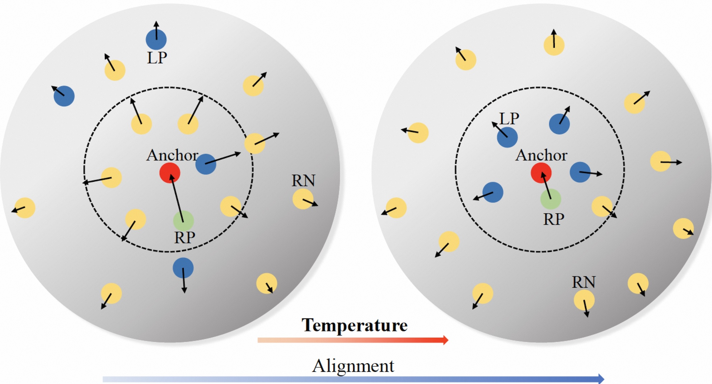

## MACL: Model-Aware Contrastive Learning: Towards Escaping Dilemmas of InfoNCE

## Todo list:
- [x] Release core code of MACL.
- [ ] Pre-training code of MACL.
- [ ] Pre-trained models.

## Acknowledgement
Many thanks to the nice work of [MMselfsup](https://github.com/open-mmlab/mmselfsup). Our codes and configs follow [MOCO](https://github.com/facebookresearch/moco) and [SimCLR](https://github.com/google-research/simclr).
